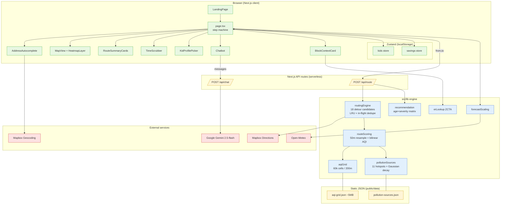
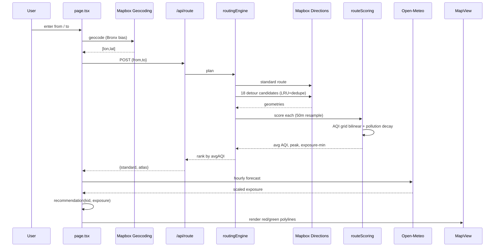

# AirAware Architecture

```mermaid
flowchart TB
  subgraph Browser["Browser (Next.js client)"]
    LP[LandingPage]
    PG[page.tsx<br/>step machine]
    AA[AddressAutocomplete]
    MV[MapView + HeatmapLayer]
    RSC[RouteSummaryCards]
    TS[TimeScrubber]
    KP[KidProfilePicker]
    CB[Chatbot]
    BC[BlockContextCard]
    subgraph Stores["Zustand (localStorage)"]
      KS[kids store]
      SS[savings store]
    end
  end

  subgraph API["Next.js API routes (serverless)"]
    RR[/POST /api/route/]
    CR[/POST /api/chat/]
  end

  subgraph Engine["src/lib engine"]
    RE[routingEngine<br/>18 detour candidates<br/>LRU + in-flight dedupe]
    RSV[routeScoring<br/>50m resample + bilinear AQI]
    AG[aqiGrid<br/>60k cells / 200m]
    PS[pollutionSources<br/>11 hotspots + Gaussian decay]
    REC[recommendation<br/>age+severity matrix]
    FS[forecastScaling]
    ER[erLookup ZCTA]
  end

  subgraph Static["Static JSON (public/data)"]
    AJ[aqi-grid.json ~5MB]
    PJ[pollution-sources.json]
  end

  subgraph External["External services"]
    MD[Mapbox Directions]
    MG[Mapbox Geocoding]
    OM[Open-Meteo]
    GM[Google Gemini 2.5-flash]
  end

  LP --> PG
  PG --> AA
  PG --> MV
  PG --> RSC
  PG --> TS
  PG --> KP
  PG --> CB
  PG --> BC
  PG <--> KS
  PG <--> SS

  AA --> MG
  PG -->|from,to| RR
  CB -->|messages| CR

  RR --> RE
  RE --> MD
  RE --> RSV
  RSV --> AG
  RSV --> PS
  AG --- AJ
  PS --- PJ
  RR --> REC
  PG --> FS
  FS --> OM
  BC --> ER

  CR --> GM

  classDef ext fill:#fde2e2,stroke:#c33
  classDef eng fill:#e2f0fd,stroke:#36c
  classDef ui  fill:#e8f7e2,stroke:#3a3
  classDef data fill:#fff5d6,stroke:#c90
  class MD,MG,OM,GM ext
  class RE,RSV,AG,PS,REC,FS,ER eng
  class LP,PG,AA,MV,RSC,TS,KP,CB,BC,KS,SS ui
  class AJ,PJ,RR,CR data
```

## Request flow — clean route

```mermaid
sequenceDiagram
  participant U as User
  participant P as page.tsx
  participant G as Mapbox Geocoding
  participant R as /api/route
  participant E as routingEngine
  participant M as Mapbox Directions
  participant S as routeScoring
  participant O as Open-Meteo
  participant V as MapView

  U->>P: enter from / to
  P->>G: geocode (Bronx bias)
  G-->>P: [lon,lat]
  P->>R: POST {from,to}
  R->>E: plan
  E->>M: standard route
  E->>M: 18 detour candidates (LRU+dedupe)
  M-->>E: geometries
  E->>S: score each (50m resample)
  S->>S: AQI grid bilinear + pollution decay
  S-->>E: avg AQI, peak, exposure-min
  E-->>R: rank by avgAQI
  R-->>P: {standard, atlas}
  P->>O: hourly forecast
  O-->>P: scaled exposure
  P->>P: recommendation(kid, exposure)
  P->>V: render red/green polylines
```
